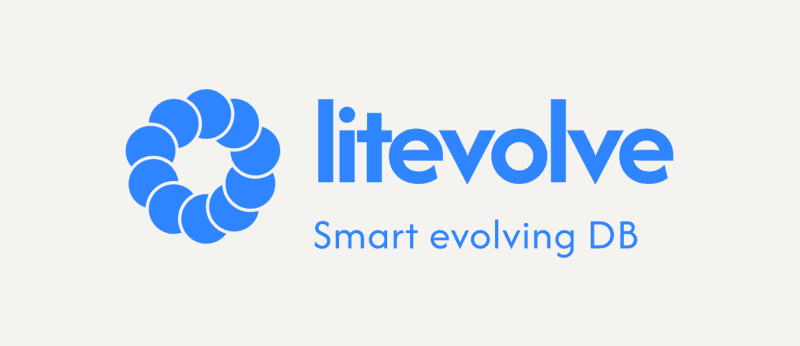

Versioned SQLite migrations for Bun, Node, and Deno — usable as a library or a CLI.

[](https://github.com/ccarcaci/litevolve/actions/workflows/ci.yml)
[](./LICENSE)

[](https://www.npmjs.com/package/litevolve-bun)
[](https://www.npmjs.com/package/litevolve-node)
[](https://www.npmjs.com/package/litevolve-deno)

[](https://bun.sh)
[](https://nodejs.org)
[](https://deno.land)

<!-- [](https://formulae.brew.sh/formula/litevolve) -->

---

## what_it_does

`litevolve` reads a directory of numbered SQL files (`{version}_name.sql`, `{version}_name.down.sql`, optional `{version}_name.seed.sql`) and applies them up or down against a SQLite database to reach a target schema version. Each step runs in a single `BEGIN IMMEDIATE` transaction so a failed seed rolls back its schema change too. The current schema version is tracked in SQLite's native `PRAGMA user_version`; a sticky `init_seeds` flag is recorded in an internal `_db_meta` table so seed behavior stays consistent across subsequent upgrades.

## status

> [!WARNING]
> Deno version of the library is not working, it has been published without being tested. The reason is that it needed to pin the "litevolve-deno" name on npm.
> Use `litevolve-node` from Deno via `npm:` specifiers until this is finished.


`litevolve` is early. One package per runtime is published on npm:

| package                                                        | source            | state                                        |
| -------------------------------------------------------------- | ----------------- | -------------------------------------------- |
| [`litevolve-bun`](https://www.npmjs.com/package/litevolve-bun)   | `runtimes/bun`    | usable — this is the reference implementation |
| [`litevolve-node`](https://www.npmjs.com/package/litevolve-node) | `runtimes/node`   | usable                                       |
| [`litevolve-deno`](https://www.npmjs.com/package/litevolve-deno) | `runtimes/deno`   | **on hold, do not use** — see below           |

`runtimes/bun` is the master copy: `make align_artifacts` copies `src/core` from it into the other
two runtimes, and `make ci_check_align` fails the build if they have drifted. Only the thin
adapter (`src/index.ts`, `src/*_adapter.ts`) differs per runtime.

Not distributed yet, despite the sections below describing them:

- **standalone binaries** — built and smoke-tested in CI, not attached to releases
- **the docker image** — `scripts/Dockerfile` exists but no image is published

## comparison

How `litevolve` stacks up against three other JS/TS-ecosystem SQLite migration tools. `drizzle-orm`
is compared on its migration tooling (`drizzle-kit`) only, not its query builder / ORM layer.

| | `litevolve` | [`sqlite-auto-migrator`](https://github.com/SanderGi/sqlite-auto-migrator) | [`deno-nessie`](https://github.com/halvardssm/deno-nessie) | [`drizzle-orm`](https://orm.drizzle.team) (migrations only) |
| --- | --- | --- | --- | --- |
| Migration format | Hand-written `.sql` files | Auto-generated `.mjs` from a schema-file diff | Function- or class-based (`up`/`down`), SQL or JS | TS schema to SQL generated by `drizzle-kit` |
| Runtimes | ✅ Bun, Node, Deno (coming soon) | Node, Bun | Deno only | ✅ Node, Bun, Deno |
| Rollback (`down`) | ✅ `.down.sql` file per version | ✅ Generated `down` function | ✅ Explicit `down()` per migration | Manual |
| Seeding | ✅ Built-in `.seed.sql` (each version has valid seeds) | Not built-in | ✅ Built-in | Not built-in |
| Runtime dependencies | ✅ No runtime dependencies | `sqlite3` (Node) or Bun's native SQLite | Per-client DB drivers | Drizzle ORM + driver of choice |
| Docker image | Coming soon | None | ✅ [`halvardm/nessie`](https://hub.docker.com/r/halvardm/nessie) (unmaintained, last updated ~5 years ago) | None |
| Executables | Coming soon | None | None | None |
| Package manager | npm + coming soon via most common managers (HomeBrew, Snap, ...) | npm only | [deno.land/x](https://deno.land/x/nessie), [nest.land](https://nest.land/package/Nessie), not on npm or Homebrew | npm only |
| Stars | 1 | 7 | 519 | 35554 |
| Open issues | ✅ 1 (Renovate dashboard) | ✅ 0 | 8 | 1977 |
| Latest release | ✅ 2026-08-11 | 2025-05-17 | 2023-09-24 | 2026-03-27 |
| Latest commit | ✅ 2026-08-22 | 2025-05-17 | 2023-09-24 | 2026-07-23 |

_Comparison stats last fetched: 2026-08-23_

## install

```sh
# Bun
bun add litevolve-bun

# Node: npm / pnpm / yarn
npm install litevolve-node
pnpm add litevolve-node
yarn add litevolve-node

# Deno — litevolve-deno is not usable yet, reach for the node package
deno add npm:litevolve-node

# Homebrew (CLI only) Not available yet
brew install litevolve
```

> **Node caveat:** `litevolve-node` uses the built-in `node:sqlite` (`DatabaseSync`), added in Node 22.5.0 and still marked experimental (Stability 1.2 — Release Candidate). It emits an `ExperimentalWarning` and its API may shift in a minor/patch release. Requires `node >= 22.5`.

## library_usage

```ts
// Import from the runtime-specific package: litevolve-bun or litevolve-node.
import { migrate_db } from "litevolve-bun"

// Apply migrations up (or down) to reach version 2.
// Returns the open Bun Database handle.
const db = migrate_db(
  2,                    // apply_version: target schema version, or undefined for "latest"
  "./migrations",       // migrations_path: directory holding the .sql files
  "./data/birds.db",    // db_path: SQLite file (or ":memory:")
  true,                 // init_seeds: only honored on a fresh DB at v0
)
```

`migrate_db` is defined per runtime in `runtimes/<runtime>/src/index.ts` — it opens the database,
sets `journal_mode = WAL` and `foreign_keys = ON`, then delegates to the shared
`migrate_with_adapter` in `src/core/migrate.ts`. It returns the open handle: a `Database` from
`bun:sqlite` for the Bun package, a `DatabaseSync` from `node:sqlite` for the Node one. The error
type is `migration_error` in `src/core/migration_error.ts`.

## CLI_usage

The CLI takes the same four inputs as named flags. `--apply_version` is optional — omit it to
migrate up to the highest-numbered migration file in `migrations_path`:

```sh
litevolve \
  --apply_version=2 \
  --db_path=./data/birds.db \
  --migrations_path=./migrations \
  --init_seeds
```

Each package declares a `litevolve` bin, so it runs via `bunx` / `npx` without installing anything:

```sh
bunx litevolve-bun --apply_version=2 --db_path=./data/birds.db --migrations_path=./migrations
npx litevolve-node --apply_version=2 --db_path=./data/birds.db --migrations_path=./migrations
```

From a clone, or as a binary you compile yourself:

```sh
bun run runtimes/bun/src/run_litevolve.ts \
  --apply_version=2 --db_path=./data/birds.db --migrations_path=./migrations

make ci_binary TARGET=bun-darwin-arm64   # -> dist/litevolve
dist/litevolve --apply_version=2 --db_path=./data/birds.db --migrations_path=./migrations
```

`make migrate` and `make migrate_seeds` wrap the first form.

## docker_usage

**No image is published yet** — `scripts/Dockerfile` builds the multi-arch binaries but nothing
pushes it to a registry. The intended usage, once it is:

To run migrations during a Docker build without installing litevolve's runtime in your image, copy the binary from the official image in a multi-stage build:

```dockerfile
FROM litevolve:latest AS migrator

FROM debian:bookworm-slim
COPY --from=migrator /usr/local/bin/litevolve /usr/local/bin/litevolve
COPY ./migrations /migrations
RUN litevolve --apply_version=3 --db_path=./data/app.db --migrations_path=/migrations
```

For Alpine-based images, use the musl-linked variant:

```dockerfile
FROM litevolve:musl AS migrator
```

This pattern is suited for baking a pre-seeded read-only SQLite file into an image. For runtime migrations against a writable volume, run litevolve at container startup instead.

## migration_file_conventions

Files in the migrations directory are validated by a strict regex:

```
0*[1-9][0-9]*_([a-z]|[A-Z]|[0-9]|_)+\.(sql|seed\.sql|down\.sql)
```

Breakdown:

- `0*` — optional leading zeros for zero-padding (padding is not required).
- `[1-9][0-9]*` — the numeric version: a non-zero leading digit followed by any digits.
- `_` — separator.
- `([a-z]|[A-Z]|[0-9]|_)+` — a `[a-zA-Z0-9_]+` description.
- `\.(sql|seed\.sql|down\.sql)` — one of three extensions.

| Extension      | Direction          | When applied                         |
| -------------- | ------------------ | ------------------------------------ |
| `.sql`         | up                 | when current_version < N ≤ target    |
| `.down.sql`    | down               | when target < N ≤ current_version    |
| `.seed.sql`    | up + init_seeds    | optional, same transaction as `.sql` |

Files that do not match the regex **throw** a `migration_error` and abort the run — the directory is
read non-recursively and every entry in it must be a migration. Keep auxiliary files (notes,
fixtures, sub-directories) out of the migrations directory, including `README.md`.

**Sort order is numeric after stripping leading zeros**, not lexicographic. `0999_x.sql` sorts before `01000_y.sql` because `parseInt("0999")` is `999` and `parseInt("01000")` is `1000`. Padding is optional and its width can vary across migrations without breaking the order: `1_…`, `0042_…`, `0999_…`, `01000_…` all sort correctly together, and an unpadded `42_…` sorts identically to `0042_…`.

Valid examples: `0001_create_initial_schema.sql`, `1234_create_users_table.sql`, `0042_add_users_language_column.down.sql`, `01000_split_audit_log.seed.sql`, `0004_iso8601_timestamps.down.sql`.
Invalid: `0000_foo.sql` (no non-zero digit), `0_foo.sql` (version 0), `0001-foo.sql` (hyphen not allowed), `0001_foo.txt` (wrong extension).

Notes about the parser (see `run_sql_statements` in `runtimes/bun/src/core/migrate.ts`):

- Line comments `-- …` are stripped, then the file is split on `;` and each statement is run on its
  own — `bun:sqlite` only surfaces the error of the *last* statement in a multi-statement string, so
  a batched migration could silently COMMIT past a failure
- The splitter is deliberately naive: no `;` or `--` inside string literals, no `BEGIN … END` triggers
- Down migrations never apply seeds. Each `.down.sql` is responsible for its own data cleanup before dropping columns or tables

## `init_seeds`_semantics

`init_seeds` is **sticky**: it is only honored when the database is at version 0 (fresh or fully rolled back). The chosen value is recorded in `_db_meta` and reused for every subsequent up-migration on the same database. Passing `--init_seeds` to a partially-migrated DB is silently ignored — this guarantees that a database either *consistently* has its seed rows or *consistently* does not. See the behavior contract in `runtimes/bun/src/migrate.test.ts` (the `init_seeds_*` tests).

## example_ornithology_database

The `migrations/working/` directory in this repository ships a runnable three-version example modelling a bird-observation system (the sibling `migrations/broken/` holds an intentionally-invalid migration used only by the test suite):

- **v1** (`0001_create_initial_schema.sql`) — minimal core, four tables:
  - `observation_sites (id, name)`
  - `birders (id, name, joined_at)`
  - `time_slots (id, site_id, starts_at, ends_at, reserved)`
  - `sightings (id, birder_id, site_id, species_common_name, observed_at, status)`

  Optional seed populates 3 sites, 8 birders (Alice Johnson, Bob Smith, …), 32 two-hour observation windows, and 3 sightings (`pending` / `verified` / `rejected`).
- **v2** (`0002_expand_schema.sql`) — adds richer metadata via `ALTER TABLE ADD COLUMN` and creates two intake tables:
  - `observation_sites` gains `latitude`, `longitude`, `habitat_type`, `timezone`.
  - `birders` gains `email`, `skill_level`, `favorite_species`, `timezone`.
  - `time_slots` gains `weather`.
  - `sightings` gains `species_scientific_name`, `individual_count`.
  - New tables `incoming_reports (id, source, raw_payload, received_at)` and `incoming_reports_archive (…, archived_at)`.

  Optional seed back-fills coordinates, skill levels, scientific names, weather notes, and sets `timezone = 'America/New_York'` for Central Park, Alice, and Bob.
- **v3** (`0003_add_birder_mentors.sql`) — adds `mentor_birder_id TEXT REFERENCES birders(id)` to `birders` (a self-referential FK). Optional seed marks Alice as the mentor of Carol/Dan/Eve and Bob as the mentor of Frank/Grace.

  The down migration demonstrates the **NULL-before-drop pattern** for foreign-key removal:

  ```sql
  -- 0003_add_birder_mentors.down.sql
  UPDATE birders SET mentor_birder_id = NULL;
  ALTER TABLE birders DROP COLUMN mentor_birder_id;
  ```

  Clearing the FK values first is the right habit even when `DROP COLUMN` would also strip the inline `REFERENCES` constraint — it's the pattern you must use when removing a FK constraint *while keeping the column*, since SQLite has no `ALTER TABLE DROP CONSTRAINT` and the alternative is a `CREATE TABLE … / INSERT SELECT / DROP / RENAME` table-rebuild that would otherwise copy stale references into the new table.

Drive it from the Makefile:

```sh
make migrate_seeds DB_PATH=./birds.db VERSION=2 MIGRATIONS_PATH=./migrations/working
sqlite3 ./birds.db "SELECT name, timezone FROM observation_sites;"
```

`MIGRATIONS_PATH` is required here: it defaults to the repository root, which holds no migrations
and would throw on the first non-matching filename.

## repository_layout

```
runtimes/bun/     litevolve-bun   — master copy of src/core, plus the bun:sqlite adapter
runtimes/node/    litevolve-node  — generated src/core, plus the node:sqlite adapter
runtimes/deno/    litevolve-deno  — generated src/core, adapter unfinished
migrations/       working/ example database, broken/ fixture used by the test suite
scripts/          every CI step, as plain shell — the Makefile only calls into these
                  (plus check_bun_version.sh, which is local-only)
```

## release_process

Versions are driven by [changesets](https://changesets.dev), one project per runtime.

```sh
# on a dev branch: bump package.json + CHANGELOG.md from the changeset files
make yield_version

# open a PR, get it reviewed, rebase main

# on main, after the merge: tag the merged commit <package>@<semver>
make yield_new_version
git push --follow-tags
```

The tag is what publishes. `.github/workflows/publish.yml` triggers on
`litevolve-{bun,node,deno}@*` tags, refuses any tag that is not an ancestor of `main`, re-checks the
tag against `package.json`, then builds, tests, packs and publishes that one package to npm with
[trusted publishing](https://docs.npmjs.com/trusted-publishers) and a provenance attestation.

## contributing_guidelines

Refer to [Makefile](./Makefile) for a comprehensive list of available helping commands.
`make ci_checks` runs everything CI does, plus `make check_version` — which checks your
installed Bun against `.bun-version` and has no CI equivalent, since CI installs Bun *from*
that file.

- OSX is recommended for development
  - if you have any experience contributing to this library under Linux please share your setup
- `litevolve` basic ecosystem is Bun, so you need Bun installed in your machine, possibly to the [.bun-version](.bun-version) version
- a fix to `src/core` goes into `runtimes/bun` and reaches the others through `make align_artifacts`
  — editing a generated copy directly will fail `make ci_check_align`
- dependency and toolchain versions are Renovate's job. `.deno-version` is the one pin no
  Renovate manager matches, so `make ci_check_updates` checks it against the latest Deno
  release — don't re-add checks for anything Renovate already covers
- the `engines` field is a **floor**: the oldest runtime the package supports, not the version
  we build with. It is raised by hand, only when a breaking change raises the real minimum
- Makefile approach is opinionated (sorry)
- Use any editor but don't push any related configuration of it, keep it in your machine
  - I currently use [Helix editor](https://helix-editor.com/)

## license

[MIT](./LICENSE)
